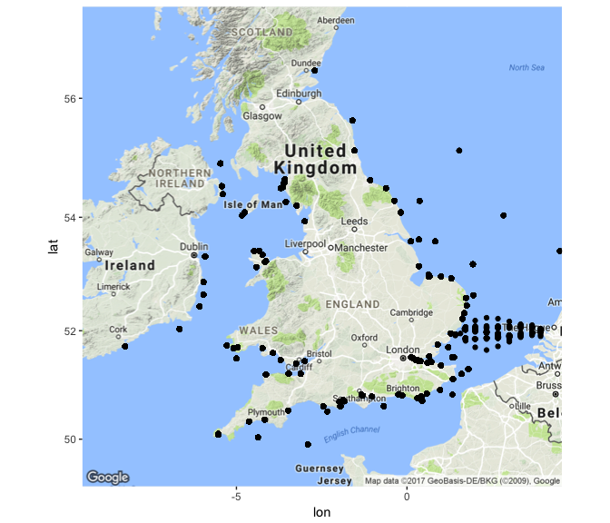

merpWS
================

<!-- README.md is generated from README.Rmd. Please edit that file -->

##### Functions to access marine data via Web Services

An increasing number of marine data portals are making web services available. These allow, alongside traditional downloads from the browser, to access data programmaticely directly from scripting softwares such as Rstudio.

The main advantages are two-folds: 1) the data fetched by R scripts are always up to date, a feature particularly useful when using data portals that are constantly added to; 2) fetching, formatting and cleaning steps can be done as part of a single seamless workflow.

merpWS is a collection of R functions making use of available marine web services to retrieve data from the main marine data portals.

Installation
------------

merpWS can be installed using the install\_github function from the devtools package.

``` r
library(devtools)
devtools::install_github(repo = "MarineEcosystemResearchProgramme/merpWS")
library(merpWS)
```

Usage
-----

Below are possible workflows making use of merpWS functions. These workflows exemplify how data from different data sources can be combined to create "added data value". Typically we combine an observed variable with one or several explanatory ones, thereby mimicking . Note that web services are in most cases recent additions to data portals and bugs on their end are common. We are working in collaboration with data holding institutes to help them improve their offer.

### Cefas data

CEFAS has recently made its API available. It allows exploring and downloading some the data described in its new Data Hub.

``` r
# list all data files
mydatasets <- get_cefas_datasets()

# extract csv files (only downloadable format)
mydownloads <- mydatasets$to_download
mydata <- mydownloads[explore_cefas_data(mydownloads$Name, keyword = "SWT"), ]

# get some coastal temperature data
temp_data <- download_cefas_data(recordset_id = mydata$Id[1])

# extract date in year, month and day from "Time"
library(magrittr)
inter <- strsplit(as.character(temp_data$Time), split = " ") %>%
  sapply(., function(x) x[[1]]) %>%
  strsplit(., split = "/") 
temp_data$day <- sapply(inter, function(x) x[[1]])
temp_data$month <- sapply(inter, function(x) x[[2]])
temp_data$year <- sapply(inter, function(x) x[[3]])
```

``` r
# plot the data
library(ggplot2)
library(ggmap)
mymap <- get_map(location = c(lon = -2.5, lat = 53.5), zoom = 6)
ggmap(mymap) + geom_point(aes(x = Long, y = Lat), data = temp_data)
```



``` r
# get some biotic data from obis
# for a coastal species
library(robis)
library(ggmap)
records_gibbula <- plot_obis(scientificname = "Gibbula umbilicalis", area.x = c(-8.267, -8.267, 4.483, 4.483, -8.267), area.y = c(49.90, 56.45, 56.45, 49.90, 49.90), myresolution = 0.5, myzoom = 5, gridded = T)
records_osilinus <- plot_obis("Osilinus lineatus", area.x = c(-8.267, -8.267, 4.483, 4.483, -8.267), area.y = c(49.90, 56.45, 56.45, 49.90, 49.90), myresolution = 0.5, myzoom = 5, gridded = T)
```

Development
-----------

merpWS functions are being developed openly on github.
